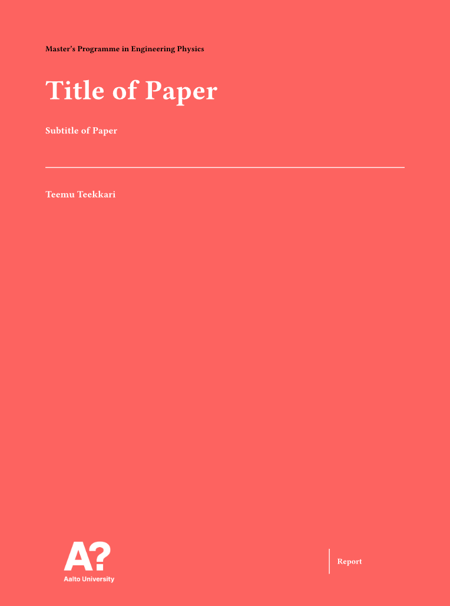

# Report / Thesis template for Aalto University made with Typst.

## Installation
Follow insructions [here](https://github.com/typst/typst) to install Typst. Additionally for usage in VSCode install the [Tinymist Typst](https://marketplace.visualstudio.com/items?itemName=myriad-dreamin.tinymist) VSCode extension.

Install the template by simply cloning this repository.

## Usage
Use this template by setting the variables at the top of main.typ and in lang.toml. After this you're ready to write. Additionally you can of course edit main.typ and lang.toml to your liking. E.g. for thesis usage you will need to add some fields to the table in #intro and to lang.toml to have all the required fields.

Note that the langiage of the content in #intro is defined by the langiage argument while the value of the field "Language" on the info page (language of the thesis) is defined in lang.toml.

For how to use typst checkout [Typst docs](https://typst.app/docs/)

## Aknowledgements

This template is a modified version of of [https://github.com/mk3z/typst-aalto-bsc-template](https://github.com/mk3z/typst-aalto-bsc-template) and based on [https://version.aalto.fi/gitlab/latex/aaltotheses](https://version.aalto.fi/gitlab/latex/aaltotheses)